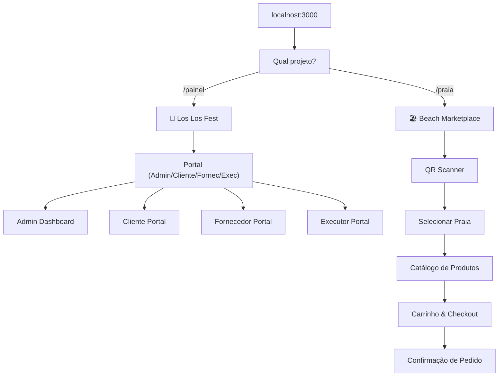
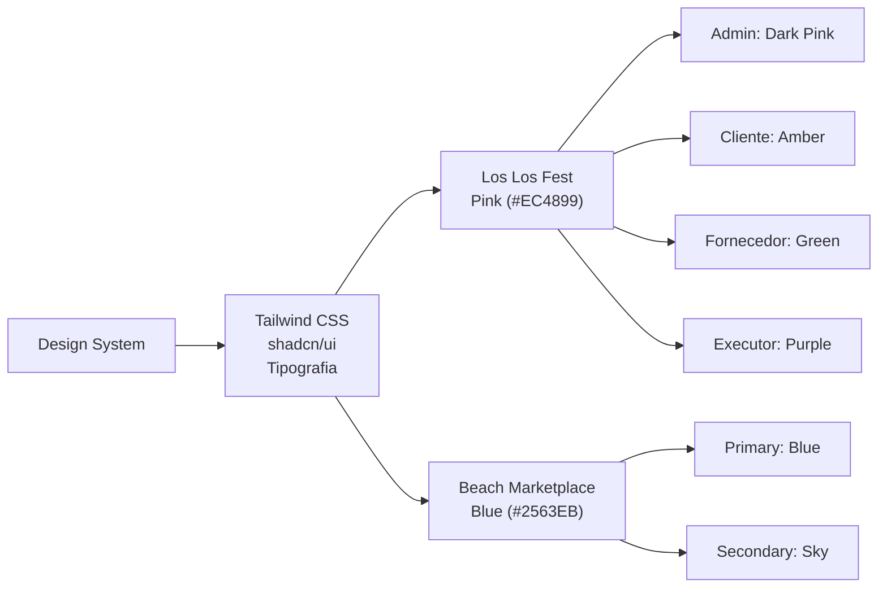
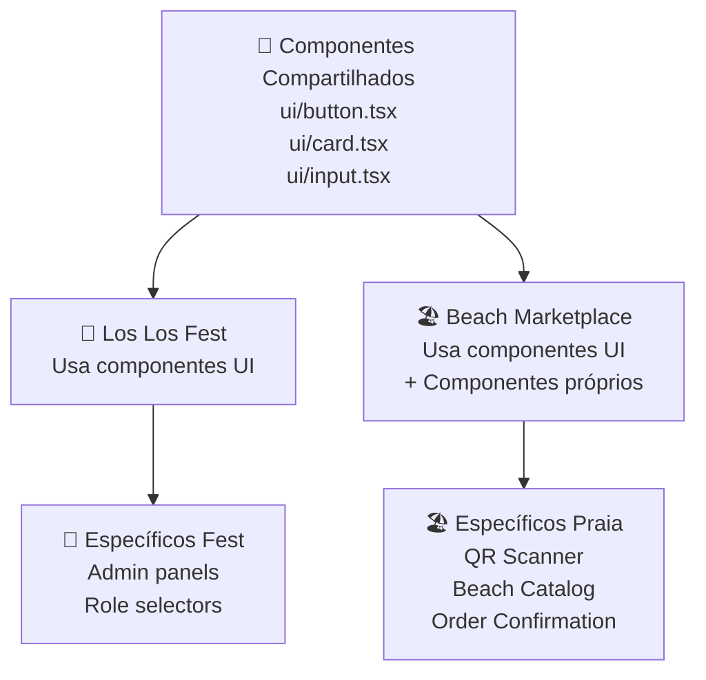
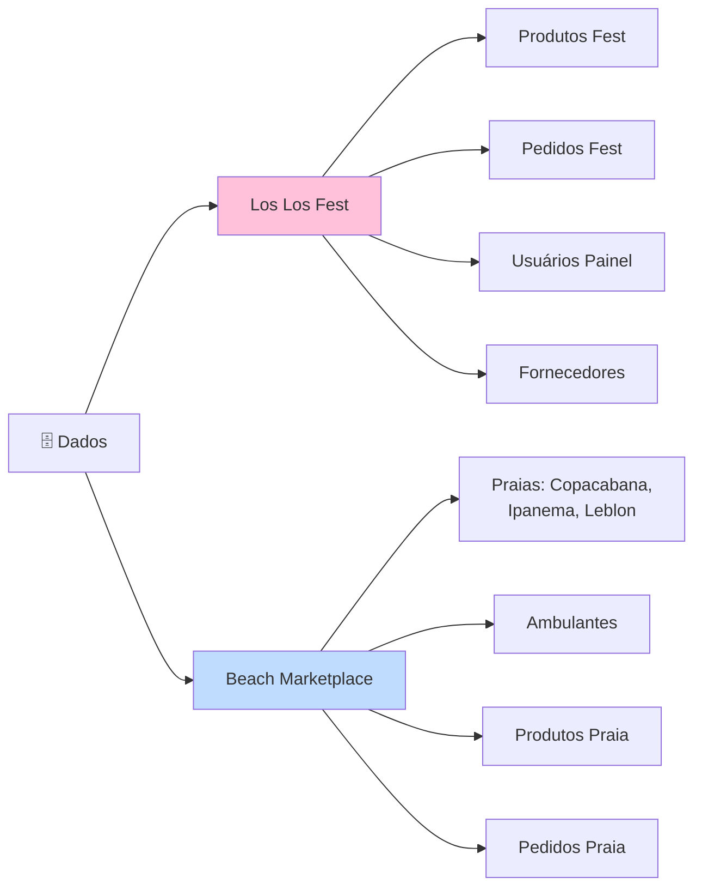
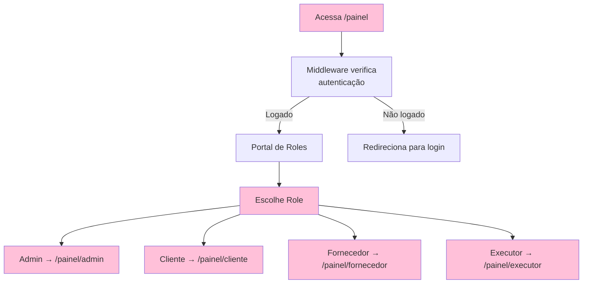
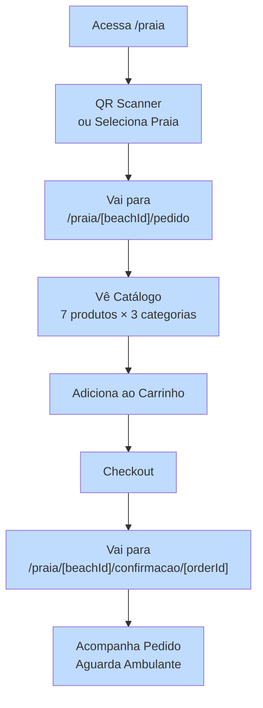
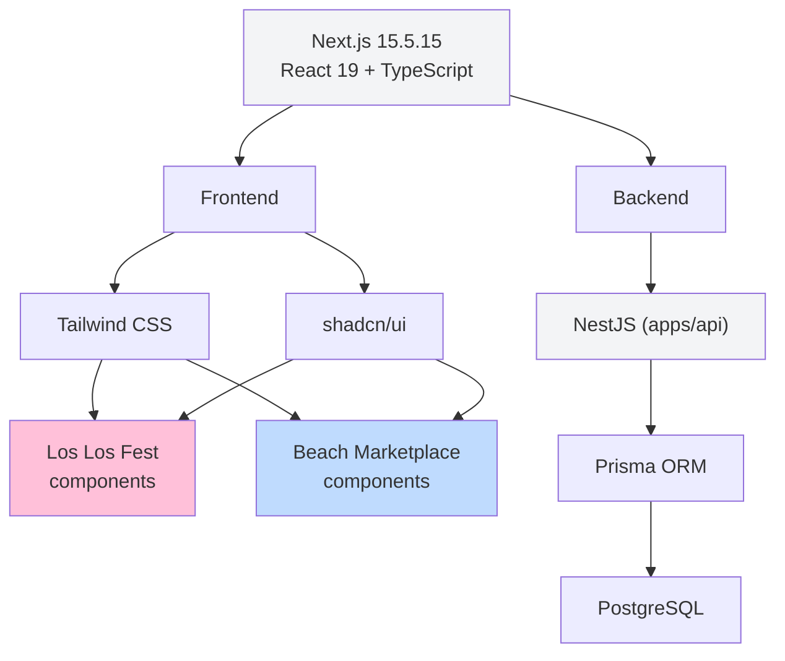
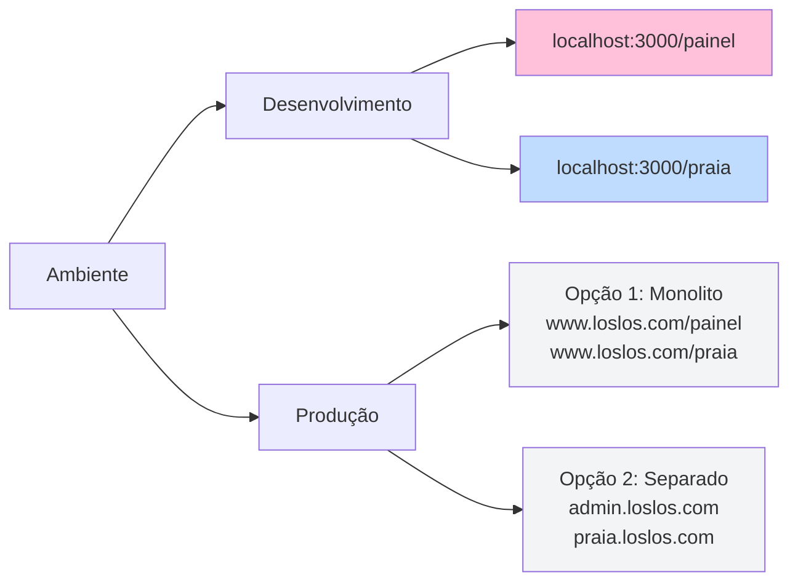

# 📊 Diagrama de Arquitetura - Projetos Separados

## Fluxo de Usuários



## Estrutura de Pastas

```
apps/web/src/
├── app/
│   ├── (painel)/                          ← LOS LOS FEST
│   │   ├── page.tsx
│   │   ├── admin/
│   │   ├── cliente/
│   │   ├── fornecedor/
│   │   └── executor/
│   │
│   └── praia/                             ← BEACH MARKETPLACE
│       ├── page.tsx
│       └── [beachId]/
│           ├── pedido/
│           ├── confirmacao/[orderId]/
│           └── ambulante/
│
├── components/
│   ├── beach-marketplace/                 ← PRAIA ONLY
│   │   ├── qr-scanner.tsx
│   │   ├── beach-catalog.tsx
│   │   ├── beach-cart.tsx
│   │   ├── order-confirmation.tsx
│   │   └── ambulante-dashboard.tsx
│   │
│   └── ui/                                ← SHARED
│       ├── button.tsx
│       ├── card.tsx
│       └── ...
│
└── lib/
    └── beach-marketplace/                 ← PRAIA ONLY
        ├── types.ts
        ├── mock-data.ts
        └── geolocation.ts
```

## Design System Semelhante



## Componentes Compartilhados vs Separados



## Dados: Separados



## Fluxo: Los Los Fest (Admin)



## Fluxo: Beach Marketplace (MVP)



## Stack Tecnológico



## Deployment



---

**Conclusão**: Dois projetos completamente separados, com identidades visuais semelhantes, rodando na mesma app Next.js por enquanto. Podem ser extraídos para repos/deployments separados quando necessário.
