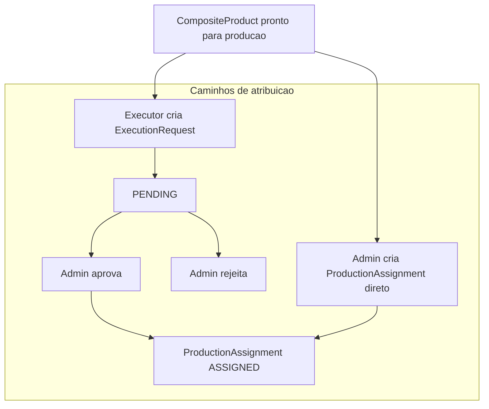
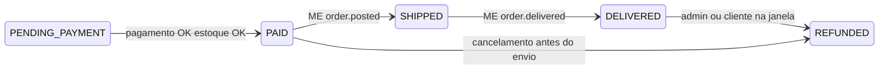
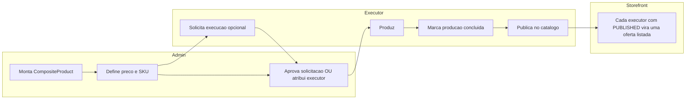

# Modelo de domínio: entidades, estados e publicação no catálogo

Este documento implementa o item **domain-model** do plano.

**Decisões consolidadas**: ver [decisoes-produto.md](./decisoes-produto.md). **Infra (Postgres + Neon, Nest no Render, Next na Vercel)**: [infrastructure.md](./infrastructure.md).

## Papéis (RBAC)

| Papel | Descrição |
|-------|-----------|
| `SUPPLIER` | Cadastra insumos (custo + frete até o executor). Pode ser complementado pelo admin. |
| `ADMIN` | Monta o **produto final** exibido ao público (preço de venda, split planejado, taxas exibidas). |
| `EXECUTOR` | Pode **solicitar** execução de um serviço (aguardando aprovação do admin) ou ser **atribuído** diretamente pelo admin; após produção, **libera a sua oferta** no catálogo público (**por executor** — ver vitrine abaixo). |
| `CUSTOMER` | Compra no storefront; **frete** na área pública pode usar cotação via **Melhor Envio** (ver [integrations-melhor-envio.md](./integrations-melhor-envio.md)). |

## Entidades principais

### SupplierProfile / ExecutorProfile / AdminUser

Extensão do `User` com tipo de conta conectada (Stripe) e metadados operacionais. **Cada usuário tem exatamente um papel** (`SUPPLIER` \| `ADMIN` \| `EXECUTOR` \| `CUSTOMER`) — **não** há múltiplos papéis na mesma conta.

**ExecutorProfile** (acordado para frete público): incluir **endereço de postagem** (CEP obrigatório para Melhor Envio) como origem do envio ao cliente final; o MVP pode evoluir para **vários CEPs** por executor ou **estoque** em endereço distinto.

### Insumo (`SupplyItem`)

Representa tecido, aviamento, etc.

| Campo conceitual | Notas |
|------------------|--------|
| `supplier_id` | Dono principal do cadastro. |
| `nome`, `sku_interno`, `unidade` | Catálogo operacional. |
| `custo_fornecedor` | Custo do item. |
| `frete_ate_executor` | Frete estimado/real do fornecedor até o executor (incluso na composição de custo). |
| `ativo` | Soft delete / descontinuação. |

**Regra**: o preço de venda ao público **não** é obrigatório aqui; o admin compõe o produto final.

### ProdutoComposto (`CompositeProduct` — modelo criado pelo admin)

Produto “roupa” **criado pelo admin** a partir de insumos + parâmetros de serviço. O registro pode existir e ser editado **antes** de existir qualquer oferta pública.

| Campo conceitual | Notas |
|------------------|--------|
| `linhas_insumo` | Lista: `supply_item_id`, `quantidade`, snapshot de custo (para congelar histórico). O **fornecedor** efetivo do split vem de cada insumo (`supplier_id` no `SupplyItem`); o admin **define a montagem** e **pode editar** linhas quando necessário (impacta custo e repasses futuros **antes** da venda). |
| `executor_fee_planejada` | Quanto o admin paga ao executor por unidade (ou por pedido — definir granularidade). |
| `platform_fee_planejada` | Margem da plataforma/admin. |
| `preco_venda_publico` | Valor final exibido; deve refletir fórmula de negócio (soma de componentes − taxa Stripe estimada − **frete médio** ao cliente usado na margem, etc.). O **frete cobrado** no checkout pode divergir: cotação real via **Melhor Envio**. |
| `stripe_price_id` / `sku` | Integração e-commerce. |
| `ativo` / `admin_paused` | Flags de moderação no **modelo** do produto; a vitrine pública é **por executor** (oferta), não um único interruptor global por SKU. |

**Regra de vitrine (catálogo público) — por executor**

- A unidade que o cliente navega e compra é a **oferta**: **`CompositeProduct` + `executor`** (materializada pela `ProductionAssignment` daquela costureira).
- **Admin cria** o desenho do produto (`CompositeProduct`); **não** existe linha pública até existir uma `ProductionAssignment` em **`PUBLISHED`** para aquele par produto+executor, com **≥1 peça** produzida e liberação explícita.
- **Pagamento**: o cliente **só conclui pagamento** se a oferta tiver **estoque disponível** (`available_quantity > 0`) na `ProductionAssignment` `PUBLISHED` — ou seja, o executor **já liberou** a oferta no marketplace com quantidade vendável. Checkout deve usar **reserva otimista** ou lock curto ao criar `PaymentIntent` para não vender o último item duas vezes.
- **Vários executores** no mesmo modelo de roupa ⇒ **várias ofertas** `PUBLISHED` candidatas. Na **experiência padrão** para o mesmo produto, **o que aparece em destaque** (card principal, CTA “Comprar”) é a oferta **mais próxima** do comprador — ver abaixo.
- Consulta típica no storefront: candidatas = `JOIN production_assignment ... WHERE status = 'PUBLISHED' AND composite_product.active AND NOT admin_paused`; **ordenar** por proximidade ao CEP (ou coordenadas) do comprador; a **primeira** é a oferta em destaque. As demais podem aparecer em “Outras costureiras” / comparador, conforme UX.
- Opcional: tabela/projéção `PublicListing` com `composite_product_id`, `executor_id`, `slug`, `published_at`, **coordenadas ou CEP normalizado** do executor (para ranking sem join pesado).

**Proximidade ao comprador (várias ofertas do mesmo produto)**

| Regra | Detalhe |
|-------|---------|
| **Critério** | Dado o **mesmo** `CompositeProduct` e **≥2** ofertas `PUBLISHED`, a oferta **em destaque** é a de **menor distância** entre o ponto do **comprador** e o ponto do **executor** (origem de envio / CEP cadastrado). |
| **Dado de entrada** | **CEP do comprador** (cookie/sessão, conta, ou passo inicial na loja). **Sem CEP**: exibir **“a partir de”** usando o **menor preço** entre ofertas `PUBLISHED` ativas daquele produto (opcionalmente incluir faixa de frete na cópia — UX); ordenação de destaque até informar CEP pode ser por menor preço ou `published_at`. |
| **Empate em distância** | Em empate (ou distância equivalente), desempatar por **menor prazo** estimado até o cliente (ex.: prazo de transportadora da cotação padrão + fila de produção, conforme modelagem). |
| **Cálculo** | Geocodificar CEP → lat/lng (centroide do CEP) e usar distância aproximada (Haversine) **ou** API de mapas; documentar que é **proxy** de proximidade, não garantia de rota. |
| **Frete** | Proximidade **geográfica** pode divergir do **frete mais barato** (rede Melhor Envio); a regra acordada aqui é **proximidade**, não menor preço de envio. |
| **SEO** | Páginas canônicas por produto podem renderizar a oferta destaque server-side usando CEP inferido (limitado) ou texto genérico + escolha no cliente. |

### SolicitacaoExecucao (`ExecutionRequest`) — opcional por produto

Quando o **executor** pede para executar um serviço ligado a um `CompositeProduct` (ou variante), antes de existir atribuição efetiva.

| Campo | Notas |
|-------|--------|
| `composite_product_id` | Serviço / produto a produzir. |
| `executor_id` | Quem solicitou. |
| `status` | `PENDING` \| `APPROVED` \| `REJECTED` \| `WITHDRAWN` (executor cancela antes da resposta). |
| `reviewed_by_admin_id`, `reviewed_at` | Preenchidos ao aprovar ou rejeitar. |
| `rejection_reason` | Opcional; útil para suporte. |

**Regras**:

- Enquanto `PENDING`, o admin pode **aprovar** (gera ou ativa a `ProductionAssignment` com esse executor) ou **rejeitar**.
- **Vários executores** podem ter **atribuições paralelas** no mesmo `CompositeProduct` (cada um com a sua oferta pública após `PUBLISHED`). Solicitações `PENDING` de executores **diferentes** para o mesmo produto **não** se excluem automaticamente; só defina exclusividade se houver regra explícita de “exclusividade regional” ou similar.
- `APPROVED` deve ser **idempotente** com a criação da `ProductionAssignment` (evitar dupla atribuição em double-click).

### AtribuiçãoProducao (`ProductionAssignment`)

Liga um `CompositeProduct` (ou variante) a um `executor_id` **efetivo**.

| Campo | Notas |
|-------|--------|
| `executor_id` | Costureira responsável (obrigatório quando em produção atribuída). |
| `assignment_source` | `ADMIN_DIRECT` \| `REQUEST_APPROVED` — como o executor entrou. |
| `execution_request_id` | Preenchido se origem for solicitação aprovada; nulo se atribuição direta. |
| `units_produced` | Peças já produzidas (mínimo **≥ 1** antes de `PUBLISHED`). |
| `available_quantity` | Quantidade que o executor **liberou para venda** no marketplace ao publicar / reabastecer; **só** essa quantidade pode ser vendida; decrementar atomicamente a cada pedido pago. |
| `status` | Ver máquina de estados abaixo. |

## Como o executor entra na produção (dois fluxos)

| Fluxo | Quem inicia | Resultado |
|--------|-------------|-------------|
| **Solicitação + aprovação** | Executor envia `ExecutionRequest` | Admin aprova → `assignment_source = REQUEST_APPROVED`, `execution_request_id` ligado. |
| **Atribuição direta** | Admin escolhe executor | `ProductionAssignment` criada (ou atualizada) com `assignment_source = ADMIN_DIRECT`, sem solicitação prévia. |

O admin pode **rejeitar** solicitações e ainda **atribuir outro executor** por atribuição direta. O executor pode **retirar** a solicitação (`WITHDRAWN`) enquanto `PENDING`, se a UX permitir.

### Operações admin (pedido / produção)

- **Reatribuição**: o **admin** pode **reatribuir** trabalho ou responsabilidade de execução quando a operação exigir (ex.: executor indisponível), com trilha de auditoria e efeitos em pedidos abertos conforme política.
- **Reembolso**: o **admin** **determina** reembolso (total/parcial) quando aplicável, alinhado à política comercial e ao fluxo Stripe; integrar com estados `REFUNDED` / repasses cancelados.

### Pedido / LinhaPedido (`Order`, `OrderLine`)

| Campo | Notas |
|-------|--------|
| `customer_id` | Comprador. |
| `payment_intent_id` / `charge_id` | Stripe. |
| `valor_total` | Auditoria (incluir frete cobrado se separado na modelagem). |
| `payout_snapshot` | JSON com valores acordados para fornecedor, executor e plataforma **no momento da compra** (imutável para o split). |
| `OrderLine.production_assignment_id` (ou `public_listing_id`) | **Obrigatório** na vitrine por executor: amarra a compra à **oferta** (`CompositeProduct` + executor) e ao CEP de origem do Melhor Envio. |
| `shipping_*` | Integração **Melhor Envio**: ver tabela abaixo. |

**Nota**: frete **fornecedor → executor** continua em `SupplyItem.frete_ate_executor` (cadeia B2B); frete **loja → cliente final** é o caso Melhor Envio no storefront.

#### Campos de envio e entrega (`Order` / `OrderLine`)

| Campo | Onde | Uso |
|-------|------|-----|
| `melhor_envio_order_id` | `Order` ou `OrderLine` | ID do envio/etiqueta na API Melhor Envio após compra da etiqueta. |
| `shipping_service_id` | `Order` / linha | Serviço escolhido na cotação (PAC, SEDEX, etc.). |
| `shipping_quote_snapshot` | `Order` | JSON da cotação aceita (auditoria). |
| `shipping_price_cents` | `Order` | Frete cobrado no Stripe. |
| `tracking_code` | `Order` | Código de rastreio exibido ao cliente. |
| `label_purchased_at` | `Order` | Quando a etiqueta foi paga/gerada (alinhado a webhook `order.released` / `order.generated` — validar na doc vigente). |
| `shipped_at` | `Order` | Primeira postagem / saída para entrega (`order.posted` ou equivalente). |
| `delivered_at` | `Order` | **Entrega ao cliente**; inicia janela de **7 dias** de reembolso (`order.delivered`). |
| `refund_eligible_until` | `Order` | Opcional: `delivered_at + 7 dias` (cache para jobs e UI). |

**Endpoint NestJS**: `POST /webhooks/melhor-envio` (nome configurável): valida assinatura (`X-ME-Signature` HMAC, ver [Webhooks Melhor Envio](https://docs.melhorenvio.com.br/docs/webhooks)), persiste payload bruto com dedupe, aplica transições idempotentes.

#### Mapeamento webhooks Melhor Envio → estado interno (referência)

Os nomes de eventos seguem a documentação oficial (podem evoluir — conferir ao implementar).

| Evento (exemplo doc) | Efeito sugerido no `Order` |
|----------------------|----------------------------|
| `order.released` / `order.generated` | Etiqueta paga/gerada → preencher `melhor_envio_order_id`, `label_purchased_at`; manter `PAID` ou subestado `FULFILLMENT_LABEL_READY`. |
| `order.posted` | Encomenda postada → `shipped_at`, transição para **`SHIPPED`**. |
| `order.delivered` | Entregue ao destinatário → `delivered_at`, transição para **`DELIVERED`** (início dos 7 dias). |
| `order.cancelled` | Etiqueta cancelada → fluxo de exceção (reemitir, estorno parcial de frete — regra operacional). |
| `order.undelivered` | Não entregue → suporte / reenvio; não setar `delivered_at`. |

#### Fluxo resumido (fulfillment)

O **split financeiro** (`PAYOUT_COMPLETED`) é **ortogonal** ao envio: o job de repasse usa `paid_at` + regras D+N e **reembolsos**; alinhar com [payout-job-spec.md](./payout-job-spec.md) se o repasse deve esperar `DELIVERED` ou só o calendário fixo.

### EventoDominio (`DomainEvent`) — opcional mas recomendado

`OrderPaid`, `OrderShipped`, `OrderDelivered`, `MelhorEnvioWebhookReceived`, `ProductionCompleted`, `ProductPublished`, `PayoutScheduled` para auditoria e workers.

## Quem publica no catálogo público

- **Admin** cria e edita o **modelo** do produto; **não** há oferta na loja até cada executor completar o seu fluxo de produção + liberação.
- **Executor** pode **solicitar** a execução; o admin **aprova** (vira atribuição) **ou** o admin **atribui direto** sem solicitação.
- **Executor** produz (`IN_PRODUCTION` → `PRODUCTION_DONE` com `units_produced >= 1`), depois **“Liberar para o público”** → `PUBLISHED` informando **`available_quantity`** (o que entra no marketplace como estoque vendável); pode aumentar estoque depois com nova liberação sem sair de `PUBLISHED`.
- **Admin** pode **pausar o modelo** (`admin_paused`): esconde **todas** as ofertas daquele produto; ou pausar só uma oferta (campo futuro em `ProductionAssignment`) se a moderação for granular.

## Máquina de estados: produção + visibilidade

Estados em `ProductionAssignment` (cada linha = um executor no produto):

| Estado | Significado | Oferta pública (produto + **este** executor) |
|--------|-------------|-----------------------------------------------|
| *(sem linha)* | Admin criou o produto, mas este executor ainda **sem** atribuição. | Não |
| `ASSIGNED` | Executor designado. | Não |
| `IN_PRODUCTION` | Produção em andamento. | Não |
| `PRODUCTION_DONE` | **≥1 peça** produzida; aguardando liberação explícita. | Não |
| `PUBLISHED` | Executor liberou a oferta ao público; estoque vendável em `available_quantity` (pode ir a 0 após vendas). | **Listagem**: sim, enquanto a regra de negócio permitir mostrar oferta esgotada; **compra** só com `available_quantity > 0`. |
| `ARCHIVED` | Esta linha encerrada. | Não (só some **esta** listagem) |

Transições válidas:

- *(sem `ProductionAssignment`)* → `ASSIGNED` ao criar a linha (admin atribui direto **ou** admin aprova `ExecutionRequest` e materializa a atribuição)
- `ASSIGNED` → `IN_PRODUCTION` (executor inicia)
- `IN_PRODUCTION` → `PRODUCTION_DONE` (executor conclui)
- `PRODUCTION_DONE` → `PUBLISHED` (executor libera) **somente se** `units_produced >= 1` **ou** outro critério objetivo de “peça pronta”; **ou** volta para `IN_PRODUCTION` (retrabalho — opcional)
- `*` → `ARCHIVED` (admin)

## Máquina de estados: pedido (resumo para split)

| Estado | Notas |
|--------|--------|
| `PENDING_PAYMENT` | Carrinho / checkout **somente** com oferta `PUBLISHED` e `available_quantity` suficiente. |
| `PAID` | Pagamento confirmado; snapshot de split; decrementar estoque; agendar payout; **comprar etiqueta** Melhor Envio (automático). |
| `SHIPPED` | Postado (`shipped_at`, webhook típico `order.posted`). |
| `DELIVERED` | Entregue (`delivered_at`, `order.delivered`); início dos **7 dias** de reembolso a partir do recebimento. |
| `REFUNDED` / `PARTIALLY_REFUNDED` | Cancelar ou ajustar repasses pendentes. |
| `PAYOUT_COMPLETED` | Todas as `Transfer` Stripe daquele pedido concluídas. |

Detalhe de campos e webhooks: seção **Campos de envio e entrega** acima.

## Política de reembolso (produto artesanal)

| Regra | Detalhe |
|-------|---------|
| **Prazo comercial** | **7 dias** a partir do **recebimento do produto pelo cliente** (`delivered_at` ou equivalente), alinhado aos termos e ao CDC com assessoria jurídica. |
| **Natureza do produto** | **Artesanal / sob encomenda**; a política deve descrever condições (defeito, divergência do combinado, prazo de produção). |
| **Direito do consumidor** | No Brasil, o **Código de Defesa do Consumidor** (ex.: contratos à distância, **art. 49**) pode impor prazos ou exceções **diferentes** do combinado comercialmente (ex.: bem **personalizado** pode ter tratamento específico). **Não é assessoria jurídica**: validar redação e exceções com advogado antes de publicar termos. |

### Efeito em pedido e payouts

- Pedidos **após entrega** (`DELIVERED` ou marcador equivalente) entram na janela de **7 dias** para arrependimento/devolução conforme política; o job de **split (ex.: D+15)** deve **cancelar ou ajustar** repasses se houver reembolso antes da liquidação (ver [payout-job-spec.md](./payout-job-spec.md) e [stripe-connect-validation.md](./stripe-connect-validation.md)).
- Se o prazo legal ou contratual de arrependimento **coincidir ou ultrapassar** a data do split, alinhar **D+15** (ou outro N) com essa análise para não transferir valores já devolvidos.

## Invariantes de negócio

1. **Snapshot no pagamento**: valores repassados ao fornecedor e executor devem vir de um **snapshot** no `PAID`, não de preços editáveis depois.
2. **Publicação na vitrine (por executor)**: cada **oferta** corresponde a uma `ProductionAssignment` em `PUBLISHED` (após **≥1** peça produzida) com **`available_quantity`** definido pelo executor, com `CompositeProduct` `ativo` e não `admin_paused`. Criação pelo admin **não** cria listagem até cada executor publicar a **sua** linha. O pedido referencia a oferta (`OrderLine` → assignment ou `public_listing_id`). Com **várias ofertas** do mesmo produto, o **destaque** segue **proximidade**; sem CEP do comprador, exibir **“a partir de”** (menor preço entre ofertas); empate em distância → **menor prazo**.
3. **Permissões**: fornecedor não publica produto final; executor não altera composição de insumos definida pelo admin (salvo regra explícita de substituição aprovada).
4. **Atribuição**: toda produção com executor efetivo passa por `ProductionAssignment`; solicitações (`ExecutionRequest`) nunca substituem a aprovação explícita do admin quando o fluxo for “pedido pelo executor”.
5. **Auth**: login com **OAuth** (IdP externo) + sessão na plataforma com **access + refresh token** (ver [auth.md](./auth.md)); **um papel por usuário**.
6. **Pagamento e estoque**: sem `available_quantity` disponível na oferta escolhida, **não** criar/confirmar pagamento.
7. **Frete vs preço final**: o total no checkout (**subtotal + frete cotado**) deve ser **coerente** com a regra comercial — ver [decisoes-produto.md](./decisoes-produto.md) item 8 e [integrations-melhor-envio.md](./integrations-melhor-envio.md).

### Nota: “captura” no Stripe (esclarecimento)

Com **estoque já publicado** antes do checkout, o fluxo usual é **PaymentIntent** com valor final (itens + frete) **capturado no sucesso** da confirmação do pagamento. **Autorização com captura tardia** reserva o limite do cartão e cobra depois (útil quando o valor final só existe mais tarde); aqui o valor final existe no checkout, então **captura imediata no pagamento** é o padrão recomendado.

## Próximo passo de implementação (NestJS)

- Módulos sugeridos: `auth`, `catalog`, `supply`, `orders`, `production`, `payouts`, `shipping` (cotação + compra de etiqueta), `webhooks` (Stripe + Melhor Envio, assinatura HMAC, dedupe), **`ThrottlerModule`** (rate limit global e por rota — ver [infrastructure.md](./infrastructure.md)).
- Sessão: **cookies HttpOnly** para tokens; **não** `localStorage` — ver [auth.md](./auth.md).
- Persistir snapshots em JSONB ou tabelas filhas versionadas.
- Expor transições via serviços de domínio com guards por papel (`@Roles`).
